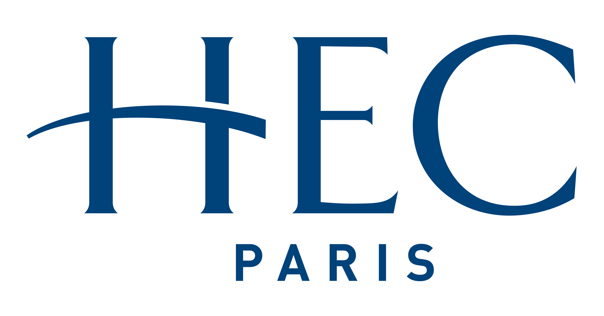

:::::::::::: columns
::: {.column width="55%"}
**My Video CV:**

<!-- Begin YouTube embed code -->

<iframe width="400" height="200" src="https://www.youtube.com/embed/3tpwWfNyDlo" title="Video Resume" frameborder="3" allow="accelerometer; clipboard-write; encrypted-media; gyroscope; picture-in-picture" allowfullscreen>

</iframe>

<!-- End YouTube embed code -->
:::

::: {.column width="10%"}
:::

::: {.column width="25%"}
**Want to Read?**

[Download My CV](docs/mariarosaria.dibagno-cv%20copy.pdf){.button download="CVResume.pdf"}
:::

::::

## Certificates

:::::: columns
::: {.column width="60%"}
{width="150" height="auto" style="text-align: center"}  

-   **Fashion&Sustainability Management**  *European Institute for Innovation and Sustainability* 

[Certificate](images/1737990851491.jpeg)

{width="100" height="auto" style="text-align: center"}

-   **Luxury Management**  *Hec Paris* 

In the summer of 2024, I attended the **HEC Paris Luxury Management Programme.** This experience at one of Europe’s top business schools allowed me to dive deep into the world of luxury, exploring the intricacies of **brand identity**, **retail strategies**, and the **emotional value** behind luxury brands.  I concluded my course with an A grade: [Access Transcript](docs/Mariarosaria_DI_BAGNO_SUMMER_2024_ copy.pdf) 

This is my certificate of attendance: [Certificate](docs/Mariarosaria_DI_BAGNO_SUMMER_2024_Summer_School_Certificate.pdf)

{width="120" height="auto" style="text-align: center"}

-   **Fashion and Luxury Management**   *Bocconi University*: [certificate](images/CERTIFICATE_LANDING_PAGE~UNPKY3DH64LW.jpeg) 
:::

::: {.column width="10%"}
:::

::::::
::::::::::::

