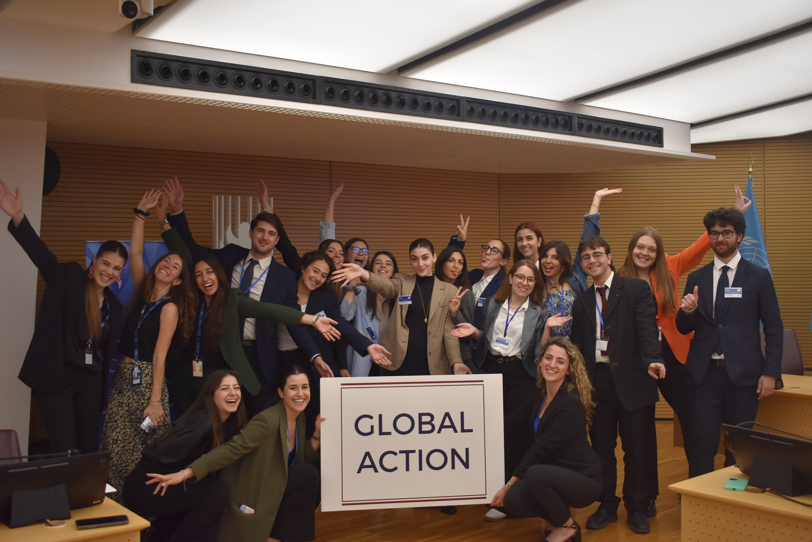
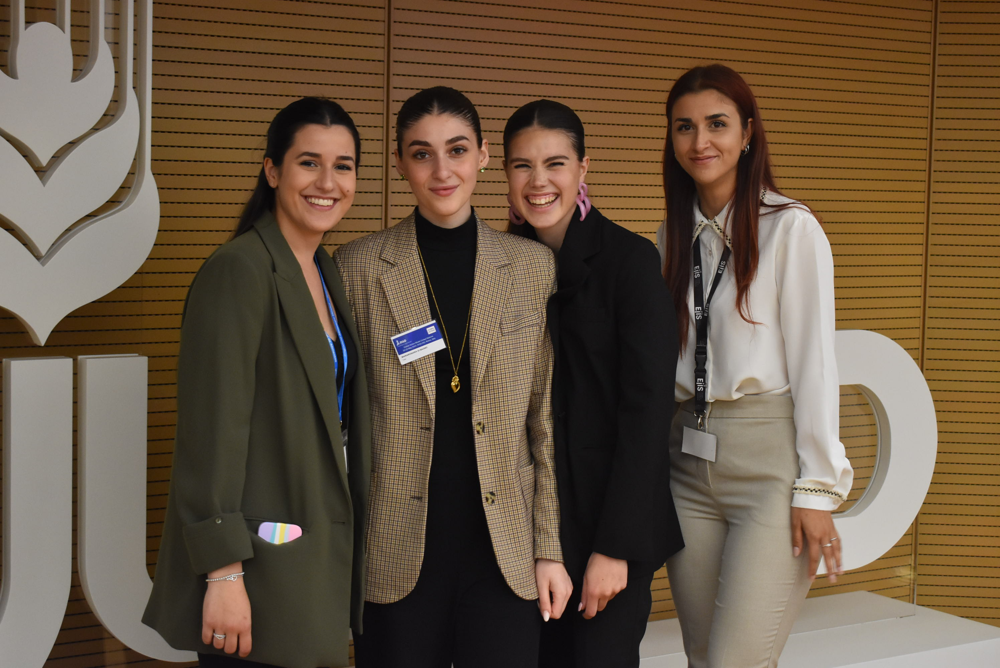
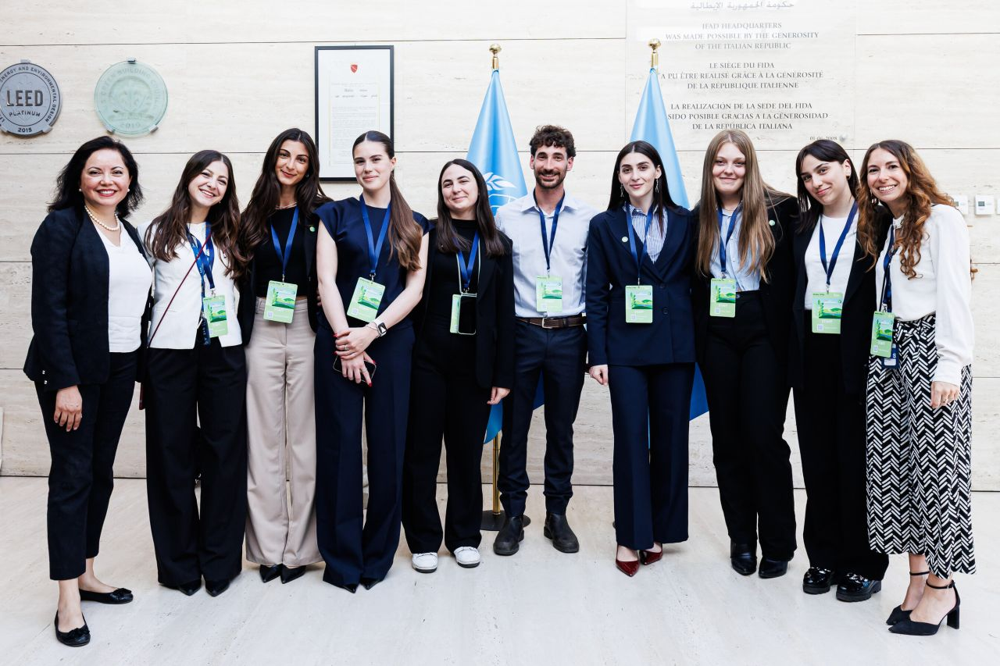
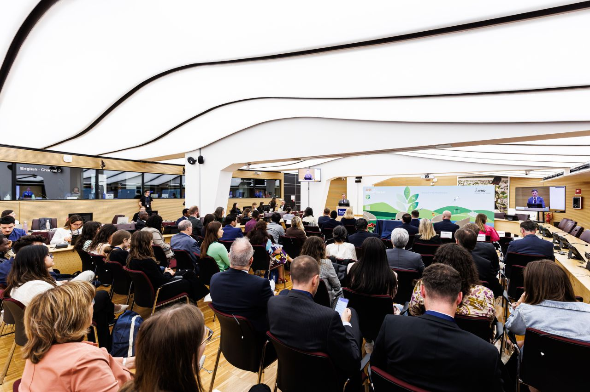

# Research Experience
## **European Youth Think Tank**
### **Policy Analyst**
### **Socioeconomic Research Assistant**

## [John Cabot University](https://www.johncabot.edu/)
### **Research Assistant**
*to professor Bogdan G. Popescu*
As a Research Assistant to Professor Bogdan G. Popescu at John Cabot University, I created a county-level map of illiteracy in Yugoslavia using data from the **1930 census**. I built the geographic dataset and final map from scratch to support research using regression discontinuity analysis. 

- I researched historical maps, georeferenced them in QGIS, and digitised county boundaries to create the shapefiles.

- I collected and translated census material, then linked the literacy figures to the mapped counties.

- I used R to produce the final map, showing how illiteracy rates varied across Yugoslavia.

[Access the Map](docs/Doc6)

# Experiences
## [Global Action](https://diplomacyeducation.org)

### **Event Manager** *(oct.2024-oct.2025)* 

At Global Action, I helped launch **Global Action Insight**, a seminar series at UNINT in Rome that introduced high school students to diplomacy and global issues. I helped develop the themes, coordinate speakers, and present and moderate sessions.

- **Women Empowerment and Leadership in the International Context (29 January 2025)**:I co-presented the inaugural seminar, introducing speakers from diplomacy, human rights, and international organisations. The discussion explored women’s leadership and encouraged students to see how they could contribute to their communities.  
{width="320" height="auto"}

- **Climate Change (21 February 2025)**:  organised and moderated a seminar that gave students a space to discuss climate change as a global challenge and consider the role of international cooperation.  
{width="320" height="auto"}

### **Team Coordinator** *(oct.2024-oct.2025)*
As Team Coordinator at Global Action, I managed six interns working on the Diplomacy Education project, coordinating their tasks and supporting the delivery of school activities. I worked closely with staff from the embassies of Germany, Belgium, Argentina, Indonesia, and Saudi Arabia, helping connect them with Italian high schools. Together, we created opportunities for students to learn about diplomacy directly from people working in the field.  

{width="320" height="auto"}

### **Bureau Intern** *(oct.2023-oct.2024)*
As a Junior Team Intern, I supported the Diplomacy Education project by working with embassies in Italy and connecting them with Italian high schools. The project introduced students to diplomacy through accessible, high quality educational experiences.    
 

::: columns

::: {.column width="47%"}
**Key Responsibilities**

-   **Event Coordination**   

-   **Communication and Collaboration**  

-   **Database Management**   

-   **Document Preparation**  
:::

::: {.column width="5%"}
:::

::: {.column width="47%"}
**Achievements**

-   **Leadership and Initiative**  

-   **Enhanced Organizational Efficiency**  

-   **Cross-Cultural Communication**  

-   **Administrative Capabilities** 
:::

::::::

**GAMUN -Global Action Model United Nations**

**My Role at GAMUN 2024 (20-23 May 2024)**   In May 2024, I was part of the management team for the seventh edition of the Global Action Model United Nations (GAMUN), hosted at the [International Fund for Agricultural Development](https://www.ifad.org/en/) in Rome. This event is a flagship project of Global Action Italy’s Diplomacy Education, dedicated to promoting **accessible, high-quality education on a global scale**.

I helped plan the conference and coordinate its logistics. I also chaired the World Food Programme (WFP) committee, guiding delegates through debates on “Building Resilience: Food Assistance for Disaster-Prone Communities” and “Urban Food Insecurity: Strategies for Ensuring Access in Cities.” These roles brought together my experience in event organisation and my interest in international cooperation and global food security.

:::::: columns

::: columns

::: {.column width="45%"}
{width="320" height="auto"}
:::

::: {.column width="10%"}
:::

::: {.column width="45%"}
{width="320" height="auto"}
:::

:::::: 

:::

## [IFAD](https://www.ifad.org/en/) 

### **Event Consultant**

:::::: columns

::: columns

::: {.column width="45%"}
{width="300" height="auto"}
:::

::: {.column width="10%"}
:::

::: {.column width="45%"}
{width="300" height="auto"}
::: 

::::::

:::

